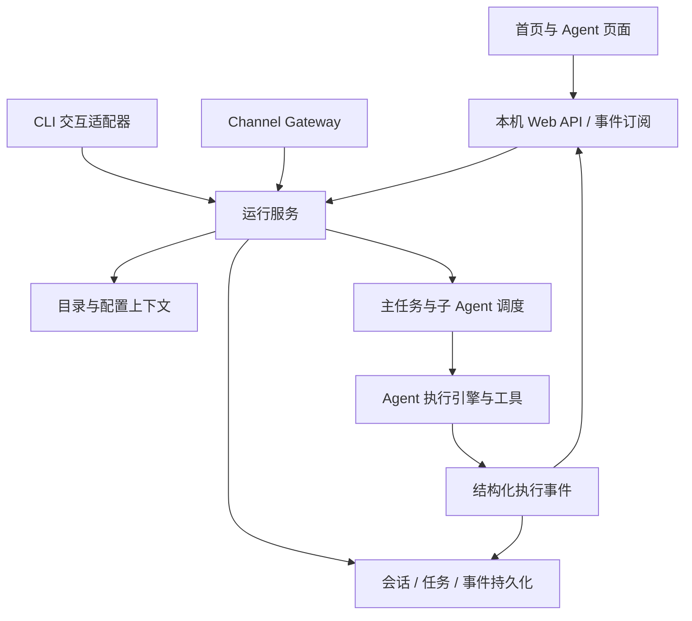

# Cheese Agent 本机 Web 工作台 Spec

日期：2026-09-18  
状态：产品需求已确认，本机实现及技术验收已交付；第 4 节保留规划时的代码基线。当前证据与未验证项见 [UI-10 验收记录](../verification/local-agent-ui.md)。
关联：[Tickets](../tickets/local-agent-ui/README.md)

## 1. 问题与目标

目前主要通过 CLI 与 Agent 交互，Channel 面向外部消息收发。用户需要一个由 CLI 启动的本机 Web 工作台，在多个本机目录中发起任务，观察 Agent 与子 Agent 的执行过程，并恢复历史会话。

首页既是有科幻动效的视觉入口，也是日常工作的入口。Agent 页面承担持续对话、执行观测和停止任务。UI 是展示层，Web、CLI 与现有 Channel 复用运行服务，任务生命周期不依赖浏览器连接。

## 2. 已确认的产品决策

| ID | 决策 |
| --- | --- |
| D01 | 第一版本机使用，通过 CLI 启动 Web 工作台。 |
| D02 | 首页提供工作目录选择、新任务输入、最近会话入口。 |
| D03 | 首页采用深色背景、发光粒子核心和轻微空间纵深；交互与任务状态驱动动效。 |
| D04 | Agent 页采用可收起的左侧会话列表、中间对话、按需展开的右侧执行详情。 |
| D05 | 支持多个本机工作目录；接入已经存在的文件夹，不创建项目或克隆仓库。 |
| D06 | 会话创建后固定绑定工作目录；切换目录时创建或选择该目录的会话。 |
| D07 | 同目录允许多个会话同时执行，共享真实文件；提示同目录其他运行会话，不自动合并或回滚。 |
| D08 | 全服务默认最多 3 个主任务运行，其余排队；子 Agent 独立使用全局默认 3 个运行额度。额度可配置。 |
| D09 | 同一个会话同时仅有一个待执行或执行中的任务；执行期间不能再提交另一条任务。 |
| D10 | 停止一次任务及其全部子 Agent，其他会话不受影响；停止期间显示“正在停止”。 |
| D11 | 关闭页面不停止任务；服务重启后未完成任务标为“已中断”，由用户手动继续。 |
| D12 | 保存对话、任务结果、工具执行记录，历史按目录隔离；刷新保留当前会话。 |
| D13 | 公共配置允许目录配置覆盖；会话创建时固定有效配置，后续修改对新会话生效。 |
| D14 | 第一版沿用配置文件，不提供模型、技能、工具、Channel 配置管理后台。 |
| D15 | 默认展示简洁执行时间线；工具参数、长输出与子任务详情可展开，不承诺展示内部思维链。 |
| D16 | 动效进入 Agent 页后收敛为状态标识；尊重系统减少动态效果偏好。 |

## 3. 用户故事与验收索引

| ID | 用户故事 | Ticket |
| --- | --- | --- |
| US01 | 作为本机用户，我希望 CLI 启动服务并提供可访问地址，以便进入工作台。 | UI-01 |
| US02 | 我希望添加、选择已有本机目录，以便在不同项目工作。 | UI-02 |
| US03 | 我希望会话固定属于一个目录，工具操作正确定位该目录，以免跨项目串用路径。 | UI-02 |
| US04 | 我希望目录覆盖公共配置，并在会话中看到实际模型和目录，以便辨认执行环境。 | UI-03 |
| US05 | 我希望从首页提交任务并进入对话页，以便立即开始工作。 | UI-01、UI-09 |
| US06 | 我希望实时看到文本输出与工具调用结果，以便理解当前进度。 | UI-04 |
| US07 | 我希望展开子 Agent 状态和摘要，以便观察并行子任务。 | UI-06 |
| US08 | 我希望同目录及不同目录的会话都能并发，以便同时推进任务。 | UI-05 |
| US09 | 我希望看到排队状态和额度限制，以便知道任务何时有机会执行。 | UI-05、UI-06 |
| US10 | 我希望停止指定任务及其子 Agent，并保持其他会话运行。 | UI-07 |
| US11 | 我希望刷新、关闭和重新打开页面后恢复记录，而不重复执行任务。 | UI-08 |
| US12 | 我希望服务重启后明确看到中断，并决定是否继续，以免重复副作用。 | UI-08 |
| US13 | 我希望从最近会话继续追问，以便保持任务上下文。 | UI-08、UI-09 |
| US14 | 我希望在首页获得科幻视觉体验，同时让工作区保持易读。 | UI-09 |
| US15 | 我希望减少动态效果、键盘操作及错误提示均可用，以便稳定使用工作台。 | UI-09、UI-10 |
| US16 | 我希望已有 CLI 与 Channel 仍能工作，并共享可靠的运行能力。 | UI-01、UI-10 |

## 4. 当前代码事实与差距

以下是本次读取所得的实现事实，不代表新增能力已经存在。

| 位置 / 符号 | 当前情况 | 对本次实现的影响 |
| --- | --- | --- |
| `src/index.ts` | 分发 init 与默认启动，尚无 Web 启动分支。 | 新增显式启动模式，保留已有入口。 |
| `src/main.ts` / `startAgent` | 模块顶层组装模型、工具、记忆、技能等，结合 REPL 与 Channel 生命周期。 | 提取可组合的运行服务，避免 UI 导入即启动 REPL。 |
| `src/channels/gateway.ts` / `handleIncoming` | 内存保存按渠道和发送者区分的消息；直接调用 agentLoop，再发送最终回复。 | 复用运行服务；保持消息渠道兼容，不强制它消费 Web 展示事件。 |
| `src/agent/loop.ts` / `agentLoop` | 流式输出直接写 stdout；参数没有外部取消信号。 | 结构化事件输出与任务级取消需要新增。 |
| `src/agent/loop-detection.ts` | 模块级 history，每次 agentLoop 调用 resetHistory。 | 并发前必须变成执行实例私有状态。 |
| `src/session/store.ts` / `SessionStore` | 相对 `.sessions` 的 JSONL 消息日志，具备 load，无 Workspace / Run / Event 模型。 | 不能直接视为多目录会话和执行记录存储。 |
| `src/tools/index.ts` | 多个文件工具按进程目录 resolve 路径。 | 路径与命令 cwd 必须显式来自任务上下文。 |
| `src/agents/spawn.ts` | 子 Agent 有自己的超时 AbortController，无父任务取消链；超额度派生被拒绝。 | 增加父子归属、统一准入与取消，避免会话之间扩大额度。 |
| `src/config/loader.ts` | 单配置文件加载，错误会退出进程。 | 支持公共与目录配置合成，目录配置错误不能击穿其他会话。 |

当前 package.json 无测试脚本，本次文件检索未发现项目测试套件。Tickets 中的测试是后续实施交付要求，本次不新增测试基础设施。

## 5. 架构与责任边界

- UI：路由、输入、展示、交互；不持有实际执行任务，不解析终端日志推断状态。
- Web 适配器：命令提交、资源读取、事件订阅；断开订阅不取消任务。
- 运行服务：Workspace、Session、Run 生命周期与命令幂等；是执行状态的唯一权威来源。
- 调度器：全局两个独立额度池、排队、任务树与额度释放。主任务等待子 Agent 时仍占一个主任务额度，子 Agent 不占主任务额度。
- 引擎：显式接收目录、有效配置、消息、事件接收器和取消信号。保留终端渲染适配器。
- 存储：持久化领域记录并支持按序事件回放；服务重启时进行状态收敛。

并发隔离的是执行上下文，不是文件副本。同目录共享文件是明确产品决策；不允许用全局写锁把整个会话串行化来规避它。禁止通过切换进程 cwd 或改写全局环境变量实现目录切换。

## 6. 领域契约

| 实体 | 必需信息与约束 |
| --- | --- |
| Workspace | 稳定 ID、规范化绝对路径、显示名、可用状态、最近访问时间；同一真实路径去重。 |
| Session | ID、workspaceId、标题、创建/更新时间、configRevisionId；workspaceId 不可变。 |
| ConfigRevision | 会话固定的非敏感有效配置、来源目录及路径解析结果、凭据引用；不得经 API 返回密钥。 |
| Run | ID、sessionId、请求幂等键、状态、起止时间、终止原因；一条用户输入对应一次执行。 |
| ChildRun | ID、parentRunId、rootRunId、任务、状态、摘要及终止原因。 |
| Message | ID、sessionId、runId、角色、内容、时间；部分输出与完成输出可区分。 |
| ExecutionEvent | 事件 ID、runId、sessionId、workspaceId、单 Run 单调序号、时间、类型、payload；可附 childRunId / toolCallId。 |

### 6.1 任务状态

主任务状态为 `queued → running → completed / failed`；停止路径为 `queued → cancelled` 或 `running → stopping → cancelled`。

- `queued / running / stopping` 均占用当前会话的唯一待完成任务位置。
- `stopping` 在仍有执行活动时继续占运行额度；确认该任务树不再执行后才能释放。
- 服务重启时，持久化的 `queued / running / stopping` 全部转为 `interrupted`，不自动重新执行。
- 终态不可被迟到事件改回运行中；停止与完成竞争时，服务以原子状态转换确定结果。
- 手动继续创建新的 Run，保留前次记录；不是从某条工具指令开始自动重放。
- 子任务区分排队、运行、停止、完成、失败、超时、取消、中断；超时与主动停止不可混为一谈。

### 6.2 工作目录与配置

- 输入绝对路径，验证存在且为可访问目录。目录失效后仍可查看历史，但不能启动新执行。
- 文件工具相对路径、shell cwd、技能加载与目录相关记忆/RAG 路径均从 Workspace 上下文派生；子 Agent 继承父任务的目录和会话配置。
- 公共配置来自服务启动时指定或默认读取的配置源；目录配置来自该目录，沿用当前配置命名及旧名称回退约定。
- 具体合并规则作为本文工程默认：对象按字段合并，数组整体替换，显式 false 生效，缺省值在合并后填充；相对路径以声明该值的配置文件所在目录为基准。
- 全服务主任务与子 Agent 额度只由服务配置管理，目录覆盖不得提高或重定义全局额度。
- 已有会话使用保存的配置版本，新会话读取最新公共/目录配置。凭据按引用解析，不在浏览器或普通事件中保存明文；凭据被撤销或缺失时明确失败，不偷偷切换模型。
- 配置快照固定参数与资源路径，不承诺冻结技能文件、代码文件和其他外部资源内容。

### 6.3 执行事件与持久化

至少覆盖：任务状态、文本增量、工具开始/结果/失败、子任务状态/摘要、重试提示与错误。通过真实事件渲染，不伪造进度百分比。

- toolCallId 关联并行调用的输入和结果，不能按“最后一次调用”猜测归属。
- 文本与事件按序持久化后可订阅；允许内部批量写入，但不能只在整次任务结束时保存全部内容。
- 快照返回事件游标；订阅支持从游标补发，客户端按事件 ID 去重，覆盖快照与实时订阅的竞争窗口。
- 同一个提交幂等键重试不得新增 Run 或重复副作用；恢复页面只读状态，不能重新提交原任务。
- 重试产生的部分输出需标明尝试归属，不能把失败尝试拼成成功结果。
- 工具输出视为普通不可信内容呈现，不执行输出中的 HTML/脚本；参数与输出先脱敏再进入持久化和展示。
- 无法持久化新任务时不确认接收、不启动；执行中存储失败停止准入并明确报错，不能宣称记录完整。

### 6.4 停止语义

取消信号须传播到模型请求、重试等待、工具、排队子任务及运行中的子 Agent。可管理的 shell 子进程需按任务归属终止；无法立即中断的操作维持“正在停止”，直到收敛，禁止先展示“已停止”而后台继续工作。

已完成写入不撤销；已发送给外部系统的操作不承诺撤回。停止某个根任务不能按进程名批量终止其他任务。

## 7. Web 接口建议

以下是工程默认契约，非声称已有 API；后续实施可调整具体命名，但需保持行为、幂等和恢复语义。推荐 HTTP 命令接口配 SSE 事件订阅，复用现有 Hono 依赖。

| 接口 | 行为 |
| --- | --- |
| GET /api/v1/status | 服务状态、全局额度与占用；不输出敏感配置。 |
| GET /api/v1/workspaces | 已接入目录及可用状态。 |
| POST /api/v1/workspaces | 接入已存在的绝对路径，规范化并去重。 |
| GET /api/v1/sessions?workspaceId=… | 当前目录会话及任务摘要。 |
| POST /api/v1/sessions | 绑定 workspaceId 并固定有效配置版本。 |
| GET /api/v1/sessions/:id | 会话、消息、当前 Run 与快照游标。 |
| POST /api/v1/sessions/:id/runs | 提交消息与幂等键，返回已持久化的任务及状态。 |
| POST /api/v1/runs/:id/stop | 幂等停止任务树，返回权威状态。 |
| GET /api/v1/runs/:id/events?after=… | 按序回放并订阅事件，含终态。 |

同会话已有待完成任务时返回冲突；目录不可用、配置无效与服务失联分别显示可理解的错误。不存在的 ID 返回未找到，不回退到默认会话。历史列表支持有界分页，避免全部历史一次性加载。

服务默认只监听 loopback，同源提供页面与 API，校验写请求来源；不新增远程登录、多用户认证或远程部署功能。具体 Web 框架、持久化格式与动效库由实施 Ticket 选择并记录，不作为本次产品承诺。

## 8. 页面行为

### 首页

顶部或输入区清晰显示当前目录与模型，支持添加目录与切换目录。主视觉为粒子核心，输入框可直接发起任务。最近会话按所选目录展示，并可看见运行或排队状态。

首次无目录时引导添加；无会话时显示新任务入口。提交成功进入新会话路由。正在运行的同目录会话显示提示，但不阻止新会话提交。

### Agent 页面

左侧会话列表可收起；主区域显示对话与任务状态；右侧执行详情按需展开。当前目录、模型和连接状态可见。运行或排队期间保留输入草稿但禁止提交，提供停止/取消入口。

时间线默认显示工具名称、运行/完成/失败状态和子任务摘要。展开查看参数与输出，长文本折叠。失败保留已有结果并允许用户继续；重试或继续是显式提交，不因页面重连自动触发。

进入工作区后粒子核心收敛为小型状态标识。刷新保持会话路由，不重播首页入场动画。窄屏时侧栏改为抽屉，避免三栏挤压正文。

### 动效与可访问性

支持键盘提交、焦点可见、抽屉关闭后焦点恢复；状态不能只用颜色表达。减少动态效果模式以静态核心或低动态状态变化替代粒子和转场。后台标签页暂停纯装饰动画，不影响服务执行。

## 9. 工程默认与非目标

本轮无需再采访的工程默认：FIFO 调度；超额子任务排队而非静默丢弃；同一会话只保留一个待完成任务；服务退出前收敛所管理的任务与进程，异常退出后的记录在重启时标为中断。

非目标：远程使用、多用户账号、配置后台、项目创建/克隆、Git worktree 自动隔离、冲突合并、文件回滚、运行中插入另一条消息、自动恢复工具执行、内部思维链展示、OS 后台守护安装、完整 IDE/文件编辑器。

已有 CLI 和 Channel 的主任务经共享服务准入，纳入同一服务额度；它们不因此获得跨渠道合并历史的功能。Cron 如继续随服务启用，其触发执行也不得绕过全局调度；本次不扩展 Cron UI。

## 10. 验收与验证策略

每个 Ticket 随功能交付验证，测试观察公开行为而非内部实现；使用可控模型、工具与临时目录验证状态、并发和取消，实际模型做单独烟雾验证，不以付费 API 作为自动化前提。

| 验收 ID | 场景 | 预期 |
| --- | --- | --- |
| AC01 | CLI 启动后访问地址，在已有目录提交任务。 | 进入 Agent 页并获得真实结果；默认 CLI 入口仍可用。 |
| AC02 | 两个目录分别读取同名相对文件；同目录再建会话。 | 目录间结果正确，同目录会话共享文件，历史与执行上下文互不串用。 |
| AC03 | 四个会话同时提交；运行任务分别派生子 Agent。 | 主任务最多 3 个、子 Agent 最多 3 个；其余明确排队，释放额度后推进。 |
| AC04 | 展开并行工具调用与子 Agent 详情。 | 参数、结果、状态准确关联，无跨会话事件串流。 |
| AC05 | 停止其中一个正在派生子 Agent 的任务。 | 该任务树停止，其他任务继续，已完成文件修改保留。 |
| AC06 | 运行时刷新/关闭页面，再打开。 | 原任务持续执行，输出补齐且无重复任务或重复消息。 |
| AC07 | 服务退出/异常终止后重启，包含排队和运行任务。 | 未完成任务标记中断，不自动执行；手动继续创建新 Run。 |
| AC08 | 修改目录配置后分别继续旧会话和创建新会话。 | 旧会话保持配置版本，新会话采用新配置；一个目录配置错误不影响其他会话。 |
| AC09 | 模型失败、工具失败、目录消失、断线重连、重复提交。 | 状态真实，错误可读，结果保留，无重复副作用或假成功。 |
| AC10 | 普通/减少动态效果模式、键盘导航和窄屏查看。 | 首页视觉与工作区均可用，输入和状态不依赖动画。 |

交付完成条件：上述场景通过，Tickets 验收记录齐全，启动/配置/停止/恢复限制已写入使用文档；本 spec 的生成不代表功能完成。

## 11. 实施决策与验证边界

采用 Hono + 原生 HTML/CSS/JS + SSE；每个根任务 fork 独立 worker，使用显式 cwd 与 IPC 配置，主服务不切换工作目录。全服务根任务与子 Agent 分别调度，Channel/Cron 在 Web 模式下复用同一个 Runtime。独立 CLI 进程使用其自己的共享执行准入，不跨进程协调额度。

第一版使用原子 JSON 快照和上一版备份，尚无大历史归档和 fsync 断电保证。独占服务锁阻止重复启动恢复活跃任务；异常退出遗留锁需确认进程退出后手动清理。技术验收与真实模型工具调用/追问已记录，用户视觉偏好和真实飞书投递未代为确认。运行、配置、恢复与这些边界见[使用文档](../local-web-workbench.md)。
